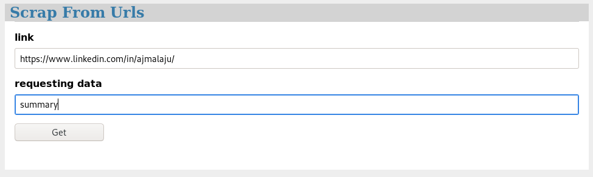
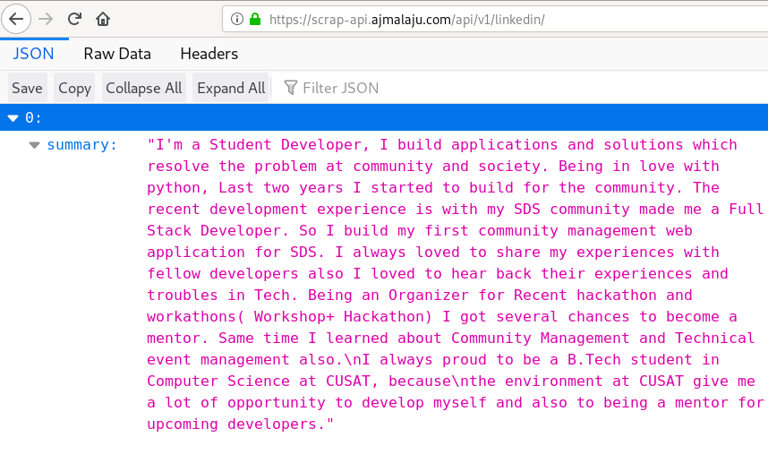
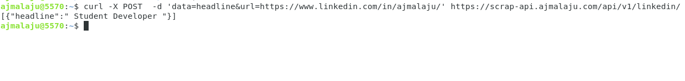

## Docs

### Tools we are using

  - `flask` : for our api application
  - `bs4` : for scrapping
  - `requests`: for authenticating with linkedin
  - `pickle` : for storing the cookijar (maintain the authenticated session)
  
  > production
  
  - `serverless` : [aws-lambda, aws-api-gateway, cloudfront, s3-bucket] for running the application
  - `s3-bucket` : for storing the cookie
  - `cloudflare,aws certificate manager`: for availing custom domain
  - `boto3` : for s3 integration (write/read cookie)
  
  

### Fire the api calls :

  - #### By using browser <hosted application @ serverless (lambda-awsapigateway-cloudfront-s3)>

     > https://scrap-api.ajmalaju.com/api/v1/linkedin/

      - url : https://www.linkedin.com/in/username/

        eg:- https://www.linkedin.com/in/ajmalaju/
      - requesting data : you can request any one of the data below at a time

         data : firstName/lastName/summary/headline

         > Request sample

         

         >Resposne sample

         

  - #### By using terminal( curl )

    - curl request format

      ```
      curl -X POST  -d 'data=<requesting data>&url=https://www.linkedin.com/in/<user>/' https://scrap-api.ajmalaju.com/api/v1/linkedin/
      ```
        > data : firstName/lastName/summary/headline
      eg:-

      ```
      curl -X POST  -d 'data=headline&url=https://www.linkedin.com/in/ajmalaju/' https://scrap-api.ajmalaju.com/api/v1/linkedin/
      ```
      >Resposne sample : curl

        

### Run the application : local/dev

 - #### clone the project

      `git clone https://github.com/Ajuajmal/scrap-flask-api.git`

    - change dir `cd scrap-flask-api/local`

 - #### create virtual env

      `virtualenv -p python3 env`

    - activate virtualenv `source env/bin/activate`

 - #### Install requirements

      `pip3 install -r requirements.txt`

  - #### Set Env Variables

      `cp .env.local .env`

      - edit and add the following in .env file `nano .env`

      - eg : -  

              ````
                LINKEDIN_MAIL = 'test@mail.com'

                LINKEDIN_PASSWORD = 'password12345'
              ````

      - save `.env` file by `CTRL+O` and exit the editor `CTRL+X`

   - # Fire the app

       `flask run`
